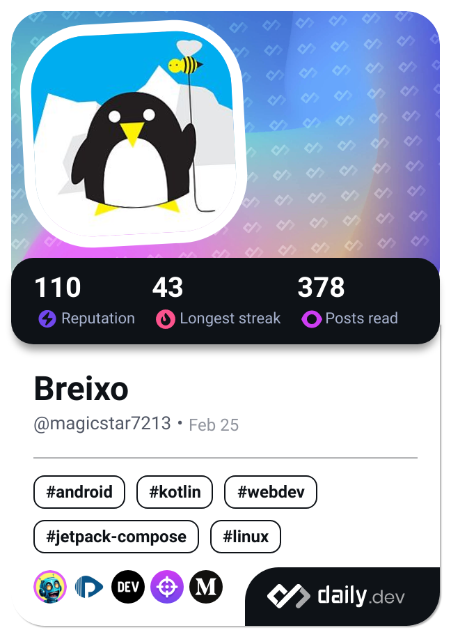

# Hey there, it's MagicStar7213!! #

Just a teen learning to code

- 🔭 I’m currently working on a time management app as a suggestion from my dad
- 🌱 I’m currently learning whatever comes up, but specially Kotlin and Python
- 👯 I’m looking to collaborate on any public repo that is not mine
- 📫 How to reach me: 
- ⚡ Fun fact: I've never focused on one technology, and maybe that's something I should change, but I'll have time for that!🤪

  
## TECHS 

## 🏆 MY STATS
  &nbsp;&nbsp;
  &nbsp;&nbsp;
  &nbsp;&nbsp;

## WHILE AFK

